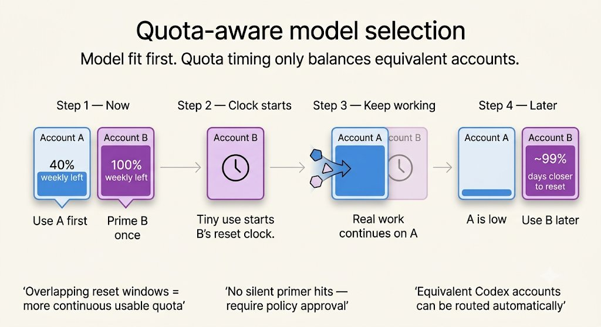
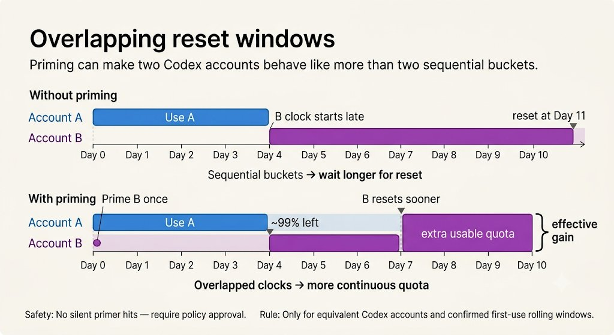

# skills

Public Agent Skills shared by Robin Braemer.

## Skills

- [`converging-npm-trusted-publishers`](converging-npm-trusted-publishers/SKILL.md) — fail-closed guidance and a tested helper for reconciling an explicit npm package allowlist to one GitHub Actions Trusted Publisher tuple through browser-harness and the user's visible Chrome profile.

  It skips exact matches, refuses unexpected publishers or UI drift, leaves WebAuthn to the human, supports redacted resume after partial completion, and requires exact post-save read-back without exposing browser or authentication material.

- [`query-local-discord-cache`](query-local-discord-cache/SKILL.md) — macOS-focused guidance for locating and safely inspecting Discord's Chromium cache, LevelDB, IndexedDB, and SQLite storage.

  Use it to find locally cached message responses, understand which stores are likely relevant, and decide whether a flexible SQLite/FTS5 archive would make repeated querying easier. It deliberately leaves retention scope and schema design to the user.

- [`quota-aware-model-selection`](quota-aware-model-selection/SKILL.md) — guidance for choosing between models, providers, accounts, quota pools, or backends using quota data.

  Useful with quota tools such as [`quota-axi`](https://github.com/kunchenguid/quota-axi). It keeps model fit first and quota second, while still capturing practical multi-account wins: for equivalent Codex accounts, spend quota that is most urgent before reset, otherwise drain the account with the least weekly quota remaining. It also covers explicitly approved early-use/primer hits for full accounts when that provider/window is confirmed to start its weekly reset clock on first use. The outcome is overlapping reset clocks and less wasted quota: a fuller account may still have nearly all quota left while already being days closer to reset.

  

  

## Usage

Copy or install the skill directory with an Agent Skills compatible harness.
